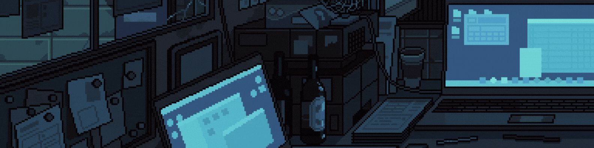

 
 

**<h1 align="center">Hi I'm Joel, a front end developer from Perú </h1>**

 

 

 
 
 
 

## **Languages and tools :**

 
 

  
  

   

  
    
     

 
      
    
  

   
     
    

   
   
   
  
  

 
 

## **Connect with me :**

 
 

  

  

  

<!--  -->

