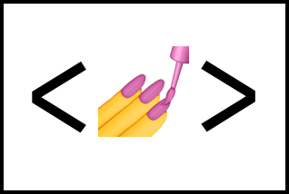

<link rel="preconnect" href="https://fonts.googleapis.com">
<link rel="preconnect" href="https://fonts.gstatic.com" crossorigin>
<link href="https://fonts.googleapis.com/css2?family=Dosis:wght@400;600;700&display=swap" rel="stylesheet">
<link rel="stylesheet" href="https://cdn.jsdelivr.net/gh/devicons/devicon@v2.14.0/devicon.min.css">

<h1 align="center" class="margin">Hi I'm Joel, a front end developer from Perú </h1>

<h2>Connect with me:</h2>

  

    
    <a class="card__link" href="https://linkedin.com/in/joel-angel-ocaño-ore-9a52b5202" target="blank">
<strong>Link : </strong>Linkedin
</a>
  

  

    
    
<strong>Id : </strong>Ryuse#0525

  

  

    
    <a class="card__link" href="#" target="blank">Slack ..</a>
  

<h2>Tools and Languages</h2>

<h3> Design</h3>

  

    <svg class="card__image img-size" xmlns="http://www.w3.org/2000/svg" viewBox="0 0 48 48" ><path d="M0 0h48v48H0z" fill="#ffd02f"/><path d="M32.708 6.4h-5.124l4.549 7.05-9.617-7.05h-5.124l4.549 9.238L12.324 6.4H7.2l4.474 11.926L7.2 41.6h5.124l9.617-24.955L17.392 41.6h5.124l9.617-27.142-4.549 27.142h5.124L42.4 11.785z" fill="#050038"/></svg>
    
<strong>Miro :</strong> To make wireframes

  

  

    
    
<strong>Figma :</strong> To Design the interfaces

  

  

   
    
<strong>Photoshop :</strong>To make adjustments and reduce the weight of the images.

  

<h3>Front end</h3>

  

    
   

  

    
    
    
    
  

  

    
    
  

  
  

